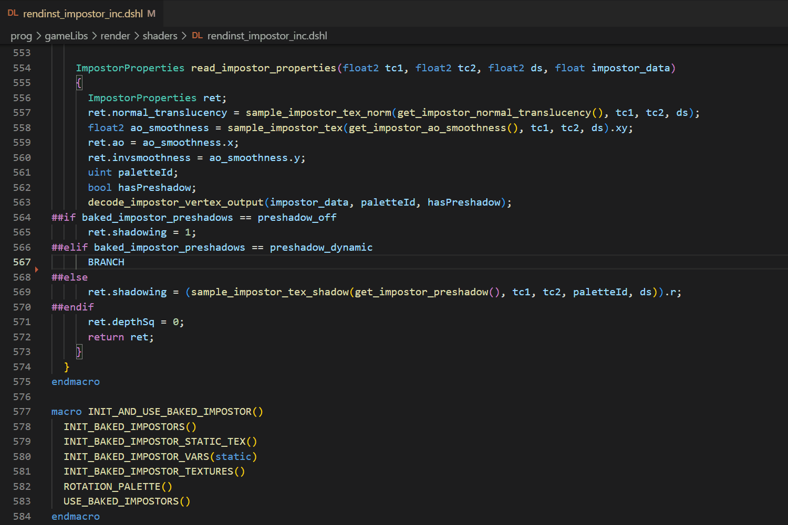

# Dagor Shader Language Support

Dagor Shader Language Support for Visual Studio Code. If you're not on x64 architecture, you have to install Node.js in order to use the extension.

## Features

### Syntax highlight

The extension colorizes types, variables, functions, constructors, keywords, modifiers, semantics, attributes, preprocessor directives, operators, literals, and comments.

### Code completion

The extension provides types, variables, functions, constructors, keywords, modifiers, semantics, attributes, shaders, block statements, preprocessor directives, code snippets, DSHL macros, and HLSL defines using IntelliSense, according to the context. It can also give you a quick summary about the item, and links to the documentation when available.

### Signature help

The extension can display a signature helper for DSHL functions, and macros.

### Document highlights

The extension can highlight all the occurrences of the selected DSHL variable, function, shader, block statement, macro or HLSL define in the file.

### Hover

The extension can provide useful information if you hover over DSHL variables, functions, shaders, block statements, macros or HLSL defines.

### Document symbols

The extension can provide outline information and breadcrumbs about DSHL variables, shaders, block statements, macros and HLSL defines. You can also easily find them by typing a @ into the Command Palette.

### Document links

The extension can follow the DSHL and the HLSL include statements. This feature only works in the desktop version.

### Inlay hints

The extension can show DSHL function, macro, and HLSL define parameters in the source code.

### Go to / Peek definitions

You can find (go to / peek) the definition of a DSHL variable, function, shader, block statement, macro or a HLSL define.

### Go to / Peek declarations

You can find (go to / peek) the declaration of a DSHL variable, function, shader, block statement, macro or a HLSL define.

### Go to / Peek implementations

You can find (go to / peek) the implementation of DSHL function, shader, block statement, macro or a HLSL define.

### Comment toggling

### Bracket matching

### Auto closing pairs

### Surrounding pairs

### Folding regions

### Indentation

### Code snippets

### File icons

## Configuration

-   `dagorShaderLanguageServer.shaderConfigOverride`: Shader configs are .blk files, usually located in the games' `prog/shaders` folders, and they determine include folders. For example: `samples/testGI/prog/shaders/shaders_dx12.blk`. If you want to override the extension's automatic shader config selection, provide the shader config's path here. Leaving it empty enables the automatic selection based on game, platform, and driver in launch options.

## Issues

If you have any problems or feature request for the extension, feel free to create an issue.

## Release Notes

For more information, see the [changelog](CHANGELOG.md).

### 1.4.1 Pre-release

-   Diagnostics

### 1.4.0 Pre-release

-   Code formatting

### 1.3.0

-   Code completion (for DSHL variables, shaders, and block statements)
-   Document highlights (for DSHL variables, functions, shaders, and block statements)
-   Hover (for DSHL variables, functions, shaders, and block statements)
-   Document symbols (for DSHL variables, shaders, and block statements)
-   Inlay hints (for DSHL functions)
-   Signature help (for DSHL functions)
-   Go to definition (for DSHL variables, functions, shaders, and block statements)
-   Go to declaration (for DSHL variables, functions, shaders, and block statements)
-   Go to implementation (for DSHL functions, shaders, and block statements)
-   Adding assume and supports code snippets
-   Adding folding ranges based on blocks
-   Several improvements, bugfixes and optimizations

### 1.2.0

-   Code completion (for HLSL defines, include statements, DSHL macro parameters)
-   Document highlights (for HLSL defines, DSHL macro parameters)
-   Hover (for HLSL defines)
-   Document symbols (for HLSL defines)
-   Inlay hints (for HLSL defines)
-   Go to definition (for HLSL defines, DSHL macro parameters)
-   Go to declaration (for HLSL defines, DSHL macro parameters)
-   Go to implementation (for HLSL defines)
-   A context menu item to the shader config files to make shader config overriding easier
-   Handling multiple declarations for DSHL macros
-   Making DSHL macros hierarchical in the document symbols
-   Adding a link to DSHL macro parameters in inlay hints
-   Several bugfixes and optimizations

### 1.1.0

-   Code completion (for built-in items, and DSHL macros)
-   Signature help (for DSHL macros)
-   Document highlights (for DSHL macros)
-   Hover (for DSHL macros)
-   Document symbols (for DSHL macros)
-   Inlay hints (for DSHL macros)
-   Go to definition (for DSHL macros)
-   Go to declaration (for DSHL macros)
-   Go to implementation (for DSHL macros)
-   Several bugfixes and optimizations

### 1.0.0

-   Syntax highlight
-   Document links
-   Comment toggling
-   Bracket matching
-   Auto closing pairs
-   Surrounding pairs
-   Folding regions
-   Indentation
-   Code snippets
-   File icons
